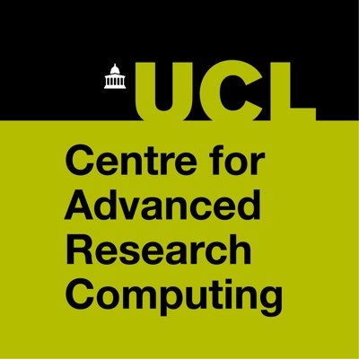
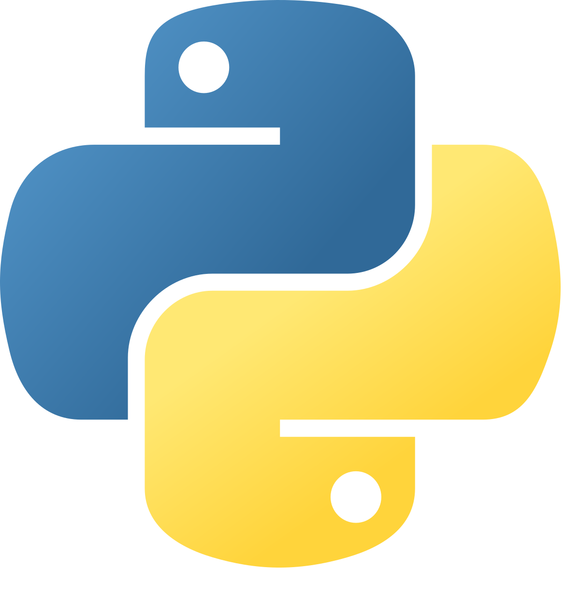
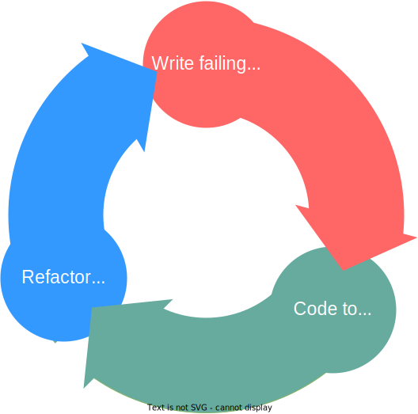

<br/><br/><br/><!-- aesthetic vspace so the title isn't too close to the UCL banner -->

# Test-driven development (in python)

## Sam Cunliffe
comms: [swc slack](https://swc-neuro.slack.com/team/U048QKV8HS9) | [github](https://github.com/samcunliffe) | [email](mailto:s.cunliffe@ucl.ac.uk)

Sainsbury Wellcome Centre pyClub. 2023-04-05.

[](https://creativecommons.org/licenses/by/4.0/)

---
<!--
footer: S Cunliffe, TDD @ SWC pyClub, 2023-04-05.
-->

# Frontmatter

- These slides are also at: `https://scnlf.me/swc-pyclub-tdd`
- All of the toy code is/will be in a [repo](https://github.com/samcunliffe/swc-pyclub-tdd):
  `git@github.com:samcunliffe/swc-pyclub-tdd.git`.
- I'm trying to do this whole thing from vscodium 🕶.
  - If I need terminal+vim you're allowed to laugh at me.

---

# Who is this guy?

<div class="left-skewed-columns">
<div>

- In a previous life wrote software for a particle physics experiment.
- Now I write software in [ARC](https://ucl.ac.uk/arc) (UCL's central RSE team.)
  - You have [specialist RSEs in Adam's Neuroinformatics Unit](https://neuroinformatics.dev/people.html)
    <div style="color:grey">(and have a cooler logo than us)</div>
- We're collaborating with Niko (mostly) on a project with Branco and Margrie labs.
- Niko asked me to talk to your gang.

</div>
<div>




</div>

---

# 💙 Python, 💛 TDD.

<div class="left-skewed-columns">
<div>

- Even though it wasn't my first, python is my favourite.
- I probably "think" in (bad) python.
  - A lot of C++ in work.
- I'm a fan of TDD. I've used it a fair bit.
  - I might be a bit of an evangelist.

</div>
<div>



</div>

---

# History lesson and some jargon.

**1996**\. Extreme programming (XP).
**1999**\. 📖 Beck, K., *Extreme Programming Explained* (1st Ed)
**2001**\. http://agilemanifesto.org/
&emsp;&emsp; (Agile is "just" an approach to sw dev.)
**2003**\. 📖 Beck, K., *Test-Driven Development by Example* (1st Ed) ([O'Reilly via UCL](https://www.oreilly.com/library/view/test-driven-development/0321146530/))

> *"Rediscovery of TDD"*

**1957**\. 📖 McCracken, D. D., *Digital Computer Programming.*
> *"... it is highly desirable that the 'customer' prepare the check case ..."*

---

# What?

- You're already testing code by running it interactively.
- Perhaps you know from experience, that you shouldn't write too much code before checking it does what you want.

<center>

# TDD is a formalisation of this process.

</center>

---

# TDD: tests first.

You have a feature or spec. or a bug.

0. **Don't** write any implementation code.
1. Write (a) failing test(s) for the feature or reproduce the bug.
   - Absolutely needs to fail in exactly the way you expect it to.
2. Now you may write some implementation.
   - *Minimal* code needed to make all tests pass.
   - Go back to 1 if you want more functionality.
3. "Refactor". Tidy up the messy minimal code (move it or rename stuff or whatever).

---

## ... the same thing formulated as a rule.

> You are **not allowed** to write any new active implementation code unless it is to make an existing test pass.

<br/><br/>

## ... the same thing formulated as emoji

<center>

# 🔴🟢🔃

</center>

---

<div class="ccolumns">
<div>

# The cycle of TDD.

</div>
<div>



</div>

---


# The ~~cycle~~ sawtooth of TDD.

<br/>
<center>


</center>


---

# Demo.

- Wanna clone?
  ```
  git clone git@github.com:samcunliffe/swc-pyclub-tdd.git
  cd swc-pyclub-tdd
  pip install -e ".[dev]"
  ```
- But you actually don't need to:
  - You could just cookiecut something with tests and a github workflow,
  - or just play along in your favourite CI-enabled current project.

---

# When _should_ you use it?

- If you have a bug that your not testing for.
   - Write a test that reproduces the bug. I.e. fails on your `main` branch.
- To implement a brand-new feature or a brand-new function.
  - Especially in a large codebase with fewer tests.
  - Especially if it's a complicated thing and you don't know how to do it yet.

<br />

> *Trust the process.*

---

# Benefits.

(In no particular order.)

- Encourages simple code.
- Encourages testable code in units.
- Bake-in constant code verification.
- Confidence.
  - Has made me look way cooler than I really am 🤫.
  - Collaborators will be more confident in your pull requests.
- Encourages focus on project spec.
  - Encode use cases in the test cases.

---

# When might you not use TDD?

- Start-ups.
- If your test suite is already comprehensive and coverage is good.

# Other disadvantages.

- False sense of confidence.
- Test code is code too (and will need to be maintained).
  - Excessive test:code ratios. (I found a talk where the dev talks about 3⨉ more test code.)
- Overzealous TDD believers 😇.
- Tests are too close in coding to your implementation.

---

<!--
footer: S Cunliffe, TDD @ SWC pyClub, 2023-04-05. 📷: [J Good, CC-BY-3.0](https://commons.wikimedia.org/wiki/File:Balance_%2859389090%29.jpeg)
-->


# Takehomes.


**Do** use TDD for bugfixing.

**Do** use TDD for clarifying specs.

**Do** use TDD for complicated/unfamiliar codebases.

Beware (anti-)implementation.

---

<!--
footer: S Cunliffe, TDD @ SWC pyClub, 2023-04-05.
-->

# Misc. tips for testing in general.

🧠

---

# A stupid example.

```python
def add(a, b):
    return a + b

def test_add():
    assert add(1, 3) == 1 + 3
```

This 👆 is not a test. No matter what the function name says.

---

# Beware...

```python
def add(a, b):
    return a + b

@pytest.mark.parametrise('a, b, res', [(1, 2, 1 + 2)])
def test_add(a, b, res):
    assert add(a, b) == res
```
Stupid, but not so stupid.

---

# Sometimes hard-coded is OK.

```python
def add(a, b):
    return a + b

@pytest.mark.parametrise('a, b, res', [(1, 2, 3)])
def test_add(a, b, res):
    assert add(a, b) == res
```

Also think lookup tables, v. small test data committed along with the code.

---

# Also test failures.

```python
with pytest.raises(PreciselyTheExceptionYouAreExpecting):
    do.illegal_thing()
```

---

# Avoid testing python itself.

```python
@dataclass
class Neuron:
    activation_threshold: float # mV

def test_neuron_object():
    n = Neuron(-60)
    assert n.activation_threshold == pytest.approx(-60.0)
```
`dataclasses.dataclass` getters and setters probably don't need testing.

---


# Appendices.

---


# Some ideas (outside of TDD).

- If you are lucky enough to have pair coding and hackdays: split up.
  - Red team writes tests, green team writes implementation.
- If you're on your own, implement many failing tests (one per `git branch`?) in a chunk then go back to the first one and implement it.
- Practice the self-discipline: write down the solution (in pencil on dead trees, if needs be), *don't* implement.

---

# Further reading.

- [Google's sw dev playbook](https://abseil.io/resources/swe-book) → [Ch. 11: Testing](https://abseil.io/resources/swe-book/html/ch11.html)
- [Microsoft's sw dev playbook](https://microsoft.github.io/code-with-engineering-playbook) → [§ about TDD](https://microsoft.github.io/code-with-engineering-playbook/automated-testing/unit-testing/tdd_example/).
- [The Turing Way guide to reproducible research](https://the-turing-way.netlify.app/reproducible-research/reproducible-research.html) → [§ about testing](https://the-turing-way.netlify.app/reproducible-research/testing.html).
- Opinions on stackoverflow.

---

# Other paradigms.

(I'm not really qualified to talk about these too much.)

- Behaviour-driven development.
  - [Similar to TDD](https://stackoverflow.com/questions/121806/behaviour-driven-or-test-driven-development) in encoding the product specs.
  - [The Turing Way](https://the-turing-way.netlify.app/reproducible-research/testing/testing-driven-development.html) says this:
     > Simply put, under the test-driven development paradigm, we check “has the thing been done correctly?”, whereas under behaviour-driven development we test “has the correct thing been done?”.
- Data-driven development.
- Docs or didn't happen.
- (A weird one) [tutorial-driven development](https://chryswoods.github.io/blog/return_of_the_king/#tutorial-driven-development).
